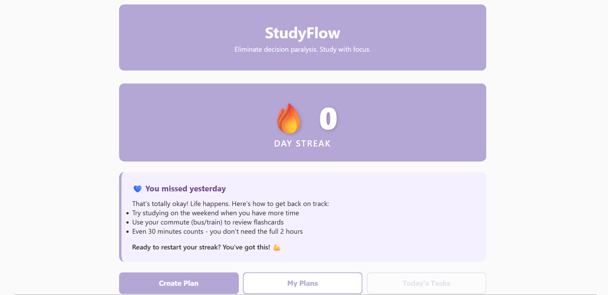

# StudyFlow

A full-stack web application that eliminates decision paralysis for students by generating detailed, hour-by-hour study plans.

## Author
Supriya Tiwari - Northeastern University

## Course
CS5610 Web Development - Fall 2025
[Course Link](https://johnguerra.co/classes/webDevelopment_fall_2025/)

## Project Objective
StudyFlow helps students overcome procrastination and decision fatigue by providing hyper-detailed study plans with specific hourly tasks. Students input what they need to learn and their deadline, and the app generates a structured plan with step-by-step instructions, resource links, and progress tracking.

## Screenshots


## Technologies Used
- **Frontend:** React (with hooks), Vite
- **Backend:** Node.js, Express
- **Database:** MongoDB Atlas (native driver)
- **Deployment:** Render

## Features
- Create personalized study plans
- Hour-by-hour task breakdown with detailed instructions
- Progress tracking with checkboxes
- Streak counter for motivation
- Gentle encouragement when missing days
- Clean, calming UI design (lavender & sage color palette based on neuroscience research)

## Installation & Setup

### Prerequisites
- Node.js v22 (LTS)
- MongoDB Atlas account
- Git

### Backend Setup
```bash
cd backend
npm install
```

Create `.env` file:
```
MONGO_URI=your_mongodb_connection_string
PORT=5000
```

Run backend:
```bash
npm run dev
```

### Frontend Setup
```bash
cd frontend
npm install
npm run build
```

### Run Full Application
With backend running, open browser to:
```
http://localhost:5000
```

## Deployment
- Backend deployed on Render
- MongoDB hosted on MongoDB Atlas
- Frontend served statically from Express

## License
MIT License